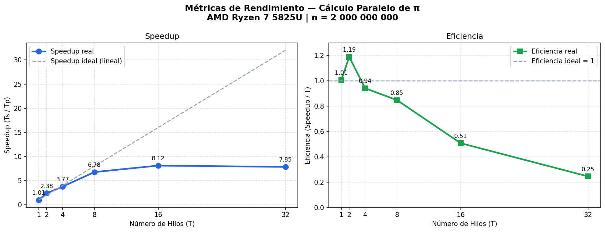

# Laboratorio de Sistemas Operativos — Práctica No. 4
## API de Hilos (Thread API)

| | |
|---|---|
| **Facultad** | Ingeniería — Ingeniería de Sistemas |
| **Asignatura** | Laboratorio de Sistemas Operativos |
| **Fecha de entrega** | Jun. 07 de 2026 (23:59) |

---

## Integrantes

| Nombre completo | Correo | Documento |
|---|---|---|
| Juan Esteban Cardozo Rivera | juan.cardozor@udea.edu.co | 1036955040 |
| Joseph Roldan Ramirez | joseph.roldan@udea.edu.co | 1115091119 |

---

## Estructura del Repositorio

```
LAB4/
├── pi.c            # Cálculo serial de π
├── pi_p.c          # Cálculo paralelo de π con Pthreads
├── fibonacci.c     # Generador de Fibonacci con hilo trabajador
├── analisis.ipynb  # Notebook de análisis de resultados
├── speedup_pi.png  # Gráfica de Speedup y Eficiencia
└── README.md
```

---

## Parte 1 — Paralelización del Cálculo de π

### Descripción

Se aproxima π mediante la integral definida:

$$\int_0^1 \frac{4}{1+x^2}\,dx = \pi$$

El algoritmo divide `[0,1]` en **n rectángulos** (método del punto medio) y suma sus áreas.

### Función integranda — `pi.c` y `pi_p.c`

```c
double f(double x)
{
    return 4.0 / (1.0 + x * x);
}
```

### Versión serial — `CalcPi` en `pi.c`

```c
double CalcPi(int n)
{
    const double fH = 1.0 / (double)n;
    double fSum = 0.0;
    double fX;
    int i;

    for (i = 0; i < n; i++)
    {
        fX    = fH * ((double)i + 0.5);
        fSum += f(fX);
    }
    return fH * fSum;
}
```

### Versión paralela — estrategia Data Parallelism en `pi_p.c`

Cada hilo recibe un sub-rango `[inicio, fin)` y calcula su suma **en una variable local** (sin mutex). El resultado parcial se almacena en la `struct` del hilo y el `main` lo recoge tras el `pthread_join`.

**Struct de argumentos por hilo:**

```c
typedef struct {
    int    inicio;     // primera iteración del sub-rango
    int    fin;        // última iteración (exclusivo)
    int    n;          // total de rectángulos
    double resultado;  // suma parcial (salida del hilo)
} ThreadArgs;
```

**Función del hilo:**

```c
void *calc_parcial(void *arg)
{
    ThreadArgs *args = (ThreadArgs *)arg;
    const double fH  = 1.0 / (double)args->n;
    double fSum_parcial = 0.0;
    int i;

    for (i = args->inicio; i < args->fin; i++)
    {
        double fX    = fH * ((double)i + 0.5);
        fSum_parcial += f(fX);
    }
    args->resultado = fSum_parcial;
    pthread_exit(NULL);
}
```

**Orquestación en `CalcPi` (main crea hilos y recoge resultados):**

```c
// Crear T hilos
for (t = 0; t < T; t++) {
    args[t].inicio = t * chunk;
    args[t].fin    = (t == T-1) ? n : args[t].inicio + chunk;
    args[t].n      = n;
    pthread_create(&hilos[t], NULL, calc_parcial, &args[t]);
}

// Esperar y agregar parciales
double fSum_total = 0.0;
for (t = 0; t < T; t++) {
    pthread_join(hilos[t], NULL);
    fSum_total += args[t].resultado;
}
return (1.0 / n) * fSum_total;
```

### Documentación de funciones

| Función | Archivo | Descripción |
|---|---|---|
| `double get_time(void)` | ambos | Retorna tiempo actual en segundos con `clock_gettime(CLOCK_MONOTONIC)` |
| `double f(double x)` | ambos | Evalúa `4 / (1 + x²)` en el punto `x` |
| `double CalcPi(int n)` | `pi.c` | Calcula π serialmente con `n` rectángulos |
| `void *calc_parcial(void *arg)` | `pi_p.c` | Función de cada hilo: calcula suma parcial de su sub-rango |
| `double CalcPi(int n, int T)` | `pi_p.c` | Orquesta `T` hilos, recoge parciales y retorna π |

---

## Parte 2 — Generador de Secuencia de Fibonacci

### Descripción

Se genera la secuencia de Fibonacci en un **hilo trabajador** que escribe sobre un arreglo compartido asignado por `main`:

```
F(-2)=0,  F(-1)=1,  F(n) = F(n-1) + F(n-2)   (n ≥ 0)
→  0, 1, 1, 2, 3, 5, 8, 13, 21, 34, ...
```

### Struct de argumentos — `fibonacci.c`

```c
typedef struct {
    long *arreglo;  // puntero al arreglo compartido (asignado por main)
    int   N;        // cantidad de términos a calcular
} FibArgs;
```

### Función del hilo trabajador

```c
void *hilo_trabajador(void *arg)
{
    FibArgs *args = (FibArgs *)arg;
    long    *arr  = args->arreglo;
    int      N    = args->N;

    if (N >= 1) arr[0] = 0;
    if (N >= 2) arr[1] = 1;

    for (int i = 2; i < N; i++)
        arr[i] = arr[i-1] + arr[i-2];

    pthread_exit(NULL);
}
```

### Flujo del hilo `main`

```c
// 1. Asignar memoria compartida
long *arreglo = malloc(N * sizeof(long));

// 2. Empaquetar argumentos
FibArgs args = { .arreglo = arreglo, .N = N };

// 3. Crear hilo trabajador
pthread_t trabajador;
pthread_create(&trabajador, NULL, hilo_trabajador, &args);

// 4. Bloquear hasta que el trabajador termine
pthread_join(trabajador, NULL);

// 5. Leer e imprimir (arreglo garantizado completo)
for (int i = 0; i < N; i++)
    printf("  F(%d) = %ld\n", i, arreglo[i]);

free(arreglo);
```

### Documentación de funciones

| Función | Descripción |
|---|---|
| `void *hilo_trabajador(void *arg)` | Recibe `FibArgs*`, calcula `N` términos de Fibonacci y los escribe en el arreglo compartido. |
| `int main(int argc, char *argv[])` | Asigna memoria con `malloc`, lanza el hilo, espera con `pthread_join` e imprime la secuencia. |

---

## Compilación

```bash
# Versión serial de π
gcc -O2 -o pi_s pi.c -lm

# Versión paralela de π
gcc -O2 -o pi_p pi_p.c -lpthread -lm

# Fibonacci
gcc -O2 -o fibonacci fibonacci.c -lpthread
```

---

## Pruebas Realizadas

### Correctitud de π

```bash
$ ./pi_s 1000000
  pi calculado : 3.1415926536
  pi real      : 3.1415926536
  error        : 2.89e-14

$ ./pi_p 1000000 4
  pi calculado : 3.1415926536
  error        : 8.26e-14
```

Ambas versiones producen el mismo resultado con error < 1e-13.

### Correctitud de Fibonacci

```bash
$ ./fibonacci 10
  F(0) = 0    F(1) = 1    F(2) = 1    F(3) = 2    F(4) = 3
  F(5) = 5    F(6) = 8    F(7) = 13   F(8) = 21   F(9) = 34
```

### Benchmarks — n = 2 000 000 000 | AMD Ryzen 7 5825U (16 núcleos)

```bash
$ ./pi_s 2000000000       →  Ts = 3.7935 s

$ ./pi_p 2000000000 1     →  Tp = 3.7736 s  | Speedup = 1.01 | Eficiencia = 1.01
$ ./pi_p 2000000000 2     →  Tp = 1.5957 s  | Speedup = 2.38 | Eficiencia = 1.19
$ ./pi_p 2000000000 4     →  Tp = 1.0075 s  | Speedup = 3.77 | Eficiencia = 0.94
$ ./pi_p 2000000000 8     →  Tp = 0.5595 s  | Speedup = 6.78 | Eficiencia = 0.85
$ ./pi_p 2000000000 16    →  Tp = 0.4673 s  | Speedup = 8.11 | Eficiencia = 0.51
$ ./pi_p 2000000000 32    →  Tp = 0.4833 s  | Speedup = 7.85 | Eficiencia = 0.25
```

### Gráfica de Speedup y Eficiencia



---

## Problemas Presentados y Soluciones

| Problema | Solución |
|---|---|
| Retornar un `double` desde un hilo vía `pthread_join` con cast a `void*` es inseguro en algunas arquitecturas. | Se almacena el resultado en el campo `resultado` de la `struct ThreadArgs`, que `main` lee tras el `pthread_join`. |
| El último hilo debe cubrir el resto de iteraciones cuando `n` no es divisible exactamente por `T`. | El último hilo recibe `fin = n` en lugar de `inicio + chunk`, asegurando cobertura completa del rango. |

---

## Video de Sustentación

> Enlace: *(agregar enlace al video de 10 minutos)*

---

## Conclusiones

1. La paralelización con Pthreads reduce el tiempo de cálculo de π de 3.79 s a 0.47 s con 16 hilos (Speedup ≈ 8×) sobre 8 núcleos físicos.
2. El overhead de creación y sincronización de hilos es despreciable cuando la carga de trabajo es suficientemente grande (n = 2 000 000 000).
3. La Ley de Amdahl impone un límite práctico: el Speedup no escala linealmente con T debido a la fracción serial del programa.
4. La eficiencia disminuye al aumentar T, especialmente al superar el número de núcleos físicos disponibles.
5. `pthread_join` es la barrera de sincronización esencial que garantiza coherencia de datos en memoria compartida; sin él se producen condiciones de carrera.
6. Fibonacci es intrínsecamente serial (cada término depende del anterior) y no se beneficia de la paralelización; el hilo trabajador ilustra el patrón de memoria compartida.
7. El punto óptimo de rendimiento en este sistema es T = 8 hilos (Eficiencia = 0.85), coincidiendo con el número de núcleos físicos.
8. Superar los núcleos físicos (T = 32) produce un Speedup ligeramente menor por el overhead de scheduling del sistema operativo.

---

## Referencias

- Arpaci-Dusseau, R. H. & Arpaci-Dusseau, A. C. *Operating Systems: Three Easy Pieces* — Cap. 26 y 27.
- The Open Group. *IEEE Std 1003.1 — POSIX Threads (Pthreads) API*.
- Lawrence Livermore National Laboratory. *POSIX Threads Programming Tutorial*.
